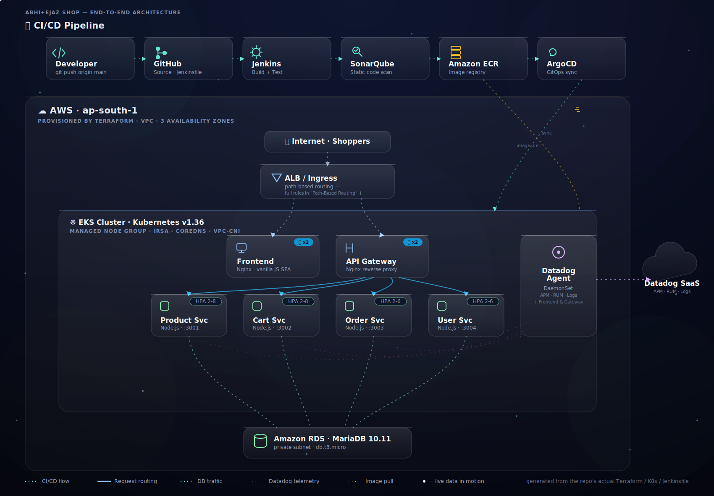

# 🛒 Abhi+Ejaz Shop
### A Production-Grade E-Commerce Platform (Flipkart × Amazon × Myntra)

> Microservices architecture · Docker · Kubernetes on AWS EKS · Terraform IaC · MariaDB · CI/CD

---

## 📋 Project Phases

| Phase | Status | Description |
|-------|--------|-------------|
| **Phase 1** | ✅ Done | All 5 backend microservices + MariaDB schema + Docker Compose |
| **Phase 2** | ✅ Done | Frontend SPA (vanilla HTML/CSS/JS, client-side router) — served via Nginx |
| **Phase 3** | ✅ Done | Production Dockerfiles (multi-stage, non-root) + ECR push |
| **Phase 4** | ✅ Done | Terraform — AWS VPC + EKS + RDS MariaDB (fully automated) |
| **Phase 5** | ✅ Done | Kubernetes manifests — Ingress, HPA, Secrets, ConfigMaps |
| **Phase 6** | ✅ Done | Jenkins CI/CD — SonarQube scan → ECR → ArgoCD sync |
| **Phase 7** | ✅ Done | Observability — Datadog Agent (APM, RUM, log collection) |

> **Note:** Phase 2 ships as a static vanilla JS SPA, not React (no `package.json`/build step exists for the frontend — only a prebuilt `dist/`). Phase 6 runs on Jenkins + SonarQube + ArgoCD, not GitHub Actions. Phase 7 uses Datadog, not Prometheus/Grafana. Descriptions below match what's actually in the repo.

---

## 🏗 Architecture

<p align="center">
  
</p>

> Live SVG — the particles, dashed flow lines, and pulsing glow actually move when viewed on GitHub (open `docs/architecture.svg` directly, or view this README on GitHub — some IDE/file previews render only a static first frame). It's generated from what's actually in this repo: `Jenkinsfile`, `terraform/*.tf`, `k8s/*.yaml`, and the six `services/*/Dockerfile`s — not the old aspirational stack.
>
> Simplified for readability — the routing shown is `/` → Frontend, `/api/*` → Gateway → services. The full per-path ingress rules are in [Path-Based Routing](#-path-based-routing-after-phase-5) below.


## 🗂 Project Structure

```
abhi-ejaz-shop/
├── services/
│   ├── db-init/          # MariaDB schema + seed data
│   │   └── init.sql
│   ├── shared/
│   │   └── db.js         # Shared DB pool
│   ├── product-service/  # Node.js :3001
│   ├── cart-service/     # Node.js :3002
│   ├── order-service/    # Node.js :3003
│   ├── user-service/     # Node.js :3004
│   ├── api-gateway/      # Nginx :80
│   └── frontend/         # (Phase 2)
├── k8s/                  # (Phase 5) + ddagent.yaml (Phase 7)
├── terraform/            # (Phase 4)
├── Jenkinsfile           # (Phase 6)
├── docker-compose.yml
└── .env.example
```

---

## 🚀 Phase 1: Local Setup

### Prerequisites
- Docker Desktop installed
- Node.js 20+ (for local dev without Docker)

### Run with Docker Compose

```bash
# 1. Clone the repo
git clone <your-repo-url>
cd abhi-ejaz-shop

# 2. Copy env file
cp .env.example .env

# 3. Start all services
docker-compose up --build

# 4. Wait ~30 seconds for MariaDB to initialize, then test:
curl http://localhost/health
curl http://localhost/api/products
curl http://localhost/api/categories
curl http://localhost/api/products/featured/all
```

### Test All Services

```bash
# Products
curl http://localhost/api/products?category=clothes
curl http://localhost/api/products?category=electronics
curl http://localhost/api/products/samsung-galaxy-s24

# Register & Login
curl -X POST http://localhost/api/auth/register \
  -H "Content-Type: application/json" \
  -d '{"name":"Abhishek","email":"abhi@test.com","password":"Test@123"}'

curl -X POST http://localhost/api/auth/login \
  -H "Content-Type: application/json" \
  -d '{"email":"abhi@test.com","password":"Test@123"}'

# Cart (replace session_id with any unique string)
curl -X POST http://localhost/api/cart/add \
  -H "Content-Type: application/json" \
  -d '{"session_id":"sess123","product_id":1,"quantity":1}'

curl "http://localhost/api/cart?session_id=sess123"
```

---

## 🎨 Phase 2: Frontend (Static SPA)

> ⚠️ **Correction:** this is a vanilla HTML/CSS/JS single-page app, not React. There's no `package.json`, no bundler, no build step — `services/frontend/dist/index.html` contains an inline `<script>` block that does client-side routing. `dist/` is also `.gitignore`d, so it's **not in version control** — if you clone this repo fresh, `services/frontend/dist/` won't exist and the Docker build below will fail until you restore it (e.g. from `abhi-ejaz-shop-complete.zip`, or by writing the files yourself).

### Files
```
services/frontend/
├── Dockerfile       # nginx:1.25-alpine, COPY dist/ → /usr/share/nginx/html/
├── nginx.conf       # gzip, asset caching, SPA fallback, /ping healthcheck
└── dist/            # NOT in git — index.html, global.css, css/main.css
```

### Run it standalone (no Docker)
```bash
cd services/frontend/dist
python3 -m http.server 8080
# or: npx serve -l 8080
```
Open `http://localhost:8080` — the inline JS router handles `/`, `/clothes`, `/electronics`, `/footwear`, `/cart`, `/orders`, `/user`, `/product/:slug` client-side. API calls from the page expect `/api/*` to be reachable (i.e. run this behind the gateway, or via Docker Compose, for the data to actually load).

### Build & run the production container
```bash
docker build -t abhi-ejaz/frontend-service:local ./services/frontend
docker run --rm -p 8081:80 abhi-ejaz/frontend-service:local

curl http://localhost:8081/ping        # → ok
curl -I http://localhost:8081/clothes  # → 200, serves index.html (SPA fallback)
```

### What `nginx.conf` actually does
| Block | Behavior |
|---|---|
| `gzip on` | Compresses js/css/json responses |
| `location ~* \.(js\|css\|png\|...)$` | 1-year immutable cache on static assets |
| `location /` | `try_files $uri $uri/ /index.html` — any unknown path falls back to `index.html` so the JS router can take over |
| `location /ping` | Returns `200 ok` — used by the K8s liveness/readiness probes in Phase 5 |

---

## 🐳 Phase 3: Production Dockerfiles + ECR

### Files
```
services/{product,cart,order,user}-service/Dockerfile   # identical pattern, 4 services
services/api-gateway/Dockerfile
services/frontend/Dockerfile
```

### The backend pattern (product/cart/order/user — all identical)
Two-stage build: install deps as `builder`, then copy `node_modules` + source into a slim final image running as a non-root `nodejs` (uid 1001) user.

```dockerfile
FROM node:20-alpine AS builder
WORKDIR /app
COPY services/product-service/package*.json ./
RUN npm install --omit=dev && npm cache clean --force

FROM node:20-alpine
RUN addgroup -g 1001 -S nodejs && adduser -S nodejs -u 1001
WORKDIR /app
COPY --from=builder --chown=nodejs:nodejs /app/node_modules ./node_modules
COPY --chown=nodejs:nodejs services/product-service/ .
COPY --chown=nodejs:nodejs services/shared ./shared
USER nodejs
EXPOSE 3000
CMD ["node", "index.js"]
```
⚠️ `EXPOSE 3000` is stale/wrong in all four Dockerfiles — every service actually listens on `process.env.PORT || 300{1,2,3,4}` (3001 product, 3002 cart, 3003 order, 3004 user), which is what's set in `docker-compose.yml` and `k8s/03-deployments.yaml`. `EXPOSE` is just documentation in Docker, so this doesn't break anything, but it'll mislead anyone reading the Dockerfile in isolation.

**Critical detail:** because the Dockerfile `COPY` paths are `services/product-service/...` (not `./`), the **build context must be the repo root**, not the `services/` folder and not the individual service folder. Run these from the repo root:
```bash
# Correct — context is . (repo root)
docker build -t abhi-ejaz/product-service:latest -f services/product-service/Dockerfile .
docker build -t abhi-ejaz/cart-service:latest    -f services/cart-service/Dockerfile    .
docker build -t abhi-ejaz/order-service:latest   -f services/order-service/Dockerfile   .
docker build -t abhi-ejaz/user-service:latest    -f services/user-service/Dockerfile    .

# Wrong — will fail, "services/product-service/package*.json" won't be found
# docker build -t abhi-ejaz/product-service -f services/product-service/Dockerfile ./services
# docker build -t abhi-ejaz/product-service ./services/product-service
```
⚠️ **This isn't just a README slip — `deploy.sh` itself has this exact bug.** Its Step 3/5 runs `docker build -f "./services/$svc/Dockerfile" ./services` — context = `./services`, not repo root. `services/services/product-service/` doesn't exist, so as committed, running `./deploy.sh` will fail the moment it tries to build `product-service`. Worth fixing in `deploy.sh` itself (`./services` → `.`) before you rely on it.

### api-gateway and frontend (single-stage, context = own folder)
```bash
docker build -t abhi-ejaz/api-gateway:latest      ./services/api-gateway
docker build -t abhi-ejaz/frontend-service:latest ./services/frontend
```

### Push to ECR
```bash
REGION="ap-south-1"
ECR_REGISTRY="<account_id>.dkr.ecr.${REGION}.amazonaws.com"   # from: terraform output ecr_registry

aws ecr get-login-password --region "$REGION" | \
  docker login --username AWS --password-stdin "$ECR_REGISTRY"

for svc in product-service cart-service order-service user-service api-gateway frontend-service; do
  docker tag  "abhi-ejaz/$svc:latest" "$ECR_REGISTRY/abhi-ejaz/$svc:latest"
  docker push "$ECR_REGISTRY/abhi-ejaz/$svc:latest"
done
```
This build+tag+push sequence for all six services is what `deploy.sh` Step 3/5 is trying to automate — once you fix the context bug noted above, `./deploy.sh` does this for you instead of running it manually.

---

## ☁️ Phase 4: Terraform (VPC + EKS + RDS + ECR)

### Files
```
terraform/
├── main.tf       # backend "s3" remote state + DynamoDB lock, AWS provider, data sources
├── vpc.tf        # terraform-aws-modules/vpc, 3 AZs, public/private/database subnets, single NAT
├── eks.tf        # terraform-aws-modules/eks v20.8.4, cluster v1.36, managed node group, IRSA
├── rds.tf        # MariaDB 10.11 db.t3.micro, SG locked to EKS nodes only, utf8mb4 param group
├── ecr.tf        # 6 repos (one per service), lifecycle policy keeps last 10 images
├── variables.tf
├── outputs.tf
└── terraform.tfvars.example
```

> 🚨 **Stop and fix this first:** `terraform/terraform.tfvars` is committed to this repo **with a real `db_password` value** (`Asp_9020`), and your AWS account ID (`262252231763`) is hardcoded in `Jenkinsfile` and `k8s/03-deployments.yaml`. This is a public repo. That password should be considered burned — rotate it on the actual RDS instance if one was ever provisioned with it, and remove `terraform.tfvars` from git (it's not even in `.gitignore` right now — only `*.tfstate` is ignored, not `terraform.tfvars`). Happy to do that cleanup (including scrubbing it from git history, which needs a force-push) if you want — just say so.

### One-time setup (remote state backend doesn't create itself)
```bash
aws s3 mb s3://abhi-ejaz-terraform-state --region ap-south-1

aws dynamodb create-table \
  --table-name abhi-ejaz-tf-lock \
  --attribute-definitions AttributeName=LockID,AttributeType=S \
  --key-schema AttributeName=LockID,KeyType=HASH \
  --billing-mode PAY_PER_REQUEST \
  --region ap-south-1
```

### Provision
```bash
cd terraform
cp terraform.tfvars.example terraform.tfvars
# edit db_password to a real value — then keep this file OUT of git

terraform init
terraform plan
terraform apply -auto-approve
```

### Pull outputs you need for later phases
```bash
terraform output cluster_name
terraform output ecr_registry
terraform output -raw rds_endpoint

aws eks update-kubeconfig --name "$(terraform output -raw cluster_name)" --region ap-south-1
kubectl get nodes
```

### What's actually provisioned
| Resource | Detail |
|---|---|
| VPC | `10.0.0.0/16`, 3 AZs, public + private + database subnets, single NAT gateway (cost-saving, not HA) |
| EKS | v1.36, public+private API endpoint, IRSA enabled, addons: coredns, kube-proxy, vpc-cni, aws-ebs-csi-driver |
| Node group | instance type/min/max/desired from `variables.tf` (currently `c7i-flex.large` in your `terraform.tfvars`, `t3.medium` in the example) |
| RDS | MariaDB 10.11, `db.t3.micro`, **not** Multi-AZ, `deletion_protection=false`, `skip_final_snapshot=true` — fine for a demo, not for anything you care about losing |
| ECR | 6 repos, scan-on-push enabled, lifecycle policy expires anything past the last 10 images |

---

## ☸️ Phase 5: Kubernetes Manifests

### Files (apply in this order)
```
k8s/00-namespace.yaml     # creates the `abhi-ejaz` namespace
k8s/01-secrets.yaml       # ⚠️ placeholder file — see note below, don't apply as-is
k8s/02-configmap.yaml     # NODE_ENV, DB_SSL, internal service URLs
k8s/03-deployments.yaml   # all 6 Deployments + ClusterIP Services
k8s/04-ingress.yaml       # ALB Ingress, path-based routing
k8s/05-hpa.yaml           # HPA for all 5 backend/gateway services
```

> ⚠️ `k8s/01-secrets.yaml` ships with **non-functional placeholder values** — e.g. `DB_HOST` is the base64 encoding of the literal string `PASTE_RDS_ENDPOINT_HERE`, not a real endpoint. If you `kubectl apply -f k8s/01-secrets.yaml` directly, every pod will crash-loop on DB connection. Use the imperative command below instead (this is what `deploy.sh` actually does).

```bash
kubectl apply -f k8s/00-namespace.yaml

kubectl create secret generic ae-secrets \
  --namespace=abhi-ejaz \
  --from-literal=DB_HOST="$(terraform -chdir=terraform output -raw rds_endpoint)" \
  --from-literal=DB_PORT=3306 \
  --from-literal=DB_USER=abhi_ejaz \
  --from-literal=DB_PASSWORD="<your-real-db-password>" \
  --from-literal=DB_NAME=abhi_ejaz_shop \
  --from-literal=JWT_SECRET="<your-real-jwt-secret>"

kubectl apply -f k8s/02-configmap.yaml
kubectl apply -f k8s/03-deployments.yaml
```

### Ingress needs the AWS Load Balancer Controller installed first
```bash
helm repo add eks https://aws.github.io/eks-charts
helm repo update
helm install aws-load-balancer-controller eks/aws-load-balancer-controller \
  -n kube-system \
  --set clusterName=abhi-ejaz-cluster \
  --set serviceAccount.create=true

kubectl apply -f k8s/04-ingress.yaml
```

### HPA needs metrics-server
```bash
kubectl apply -f https://github.com/kubernetes-sigs/metrics-server/releases/latest/download/components.yaml
kubectl apply -f k8s/05-hpa.yaml
```

### Verify
```bash
kubectl get pods -n abhi-ejaz
kubectl get hpa -n abhi-ejaz
kubectl get ingress ae-ingress -n abhi-ejaz -o wide   # ALB hostname appears here after 2-3 min
```

| Service | Replicas | CPU req/limit | Mem req/limit | HPA range |
|---|---|---|---|---|
| product-service | 2 | 100m / 300m | 128Mi / 256Mi | 2–8 @ 65% CPU |
| cart-service | 2 | 100m / 300m | 128Mi / 256Mi | 2–8 @ 65% CPU |
| order-service | 2 | 100m / 300m | 128Mi / 256Mi | 2–6 @ 65% CPU |
| user-service | 2 | 100m / 300m | 128Mi / 256Mi | 2–6 @ 65% CPU |
| api-gateway | 2 | 50m / 150m | 64Mi / 128Mi | 2–6 @ 70% CPU |
| frontend-service | 2 | 30m / 100m | 32Mi / 64Mi | no HPA defined |

---

## 🔁 Phase 6: CI/CD (Jenkins → SonarQube → ArgoCD)

> The phase table used to say "GitHub Actions" — there's no `.github/workflows/` directory anywhere in this repo. The actual pipeline is the `Jenkinsfile` at the repo root.

### Pipeline stages (`Jenkinsfile`)
1. **Checkout** — `checkout scm`
2. **SonarQube Scan** — `sonar-scanner` against `services/`, excluding `node_modules`/`.git`, using `SONAR_TOKEN` from Jenkins credential `sonarqube-token`
3. **AWS Identity Check** — `aws sts get-caller-identity` using credential `aws-creds`
4. **ECR Login** — `aws ecr get-login-password | docker login`
5. **Deploy to EKS** — `aws eks update-kubeconfig` then `kubectl get nodes` / `kubectl get pods -n abhi-ejaz`
6. **ArgoCD Login and Sync** — `argocd login`, `argocd app sync abhi-ejaz-shop`, `argocd app wait --health --timeout 300` using credential `argocd-password`

> ⚠️ Read stage 5 again: it **does not build images, push to ECR, or `kubectl apply` anything** — it only verifies cluster state. The actual deploy is left to ArgoCD's sync in stage 6, which means there has to be an ArgoCD `Application` already pointed at a manifests source (a Git repo/path it watches), and *that* source has to get updated with new image tags somehow — none of which exists in this repo. As written, this pipeline scans + verifies + triggers a sync; it does not by itself turn a `git push` into a running new version. If "push = auto deploy" is the goal, you're missing the image-tag-update step (e.g. an image updater, or a CD step that edits `k8s/03-deployments.yaml` and commits/pushes it for ArgoCD to pick up).

### Jenkins setup
```text
Manage Jenkins → Credentials → add:
  sonarqube-token   (Secret text)
  aws-creds         (AWS Credentials)
  argocd-password   (Secret text)

New Item → Pipeline (or Multibranch Pipeline) → point "Pipeline script from SCM" at this repo, script path: Jenkinsfile
```

### Trigger a run
```bash
git push origin main     # if a webhook/SCM-polling trigger is configured on the job
# otherwise: Jenkins UI → the job → "Build Now"
```

---

## 📈 Phase 7: Observability (Datadog)

> The Tech Stack table used to say "Prometheus + Grafana" — there's no Prometheus or Grafana config anywhere in this repo. The actual file is `k8s/ddagent.yaml`, a `DatadogAgent` CRD.

### What `k8s/ddagent.yaml` configures
| Feature | Setting |
|---|---|
| Cluster checks | enabled |
| Orchestrator Explorer | enabled |
| APM auto-instrumentation | enabled for java, python, js, php, dotnet, ruby workloads |
| RUM (frontend monitoring) | enabled — application ID + client token + site (`us5.datadoghq.com`) hardcoded in the YAML |
| Log collection | enabled, `containerCollectAll: true` |

The RUM `DD_RUM_CLIENT_TOKEN` is meant to be public (it's embedded in client-side JS by design), so that one being in the repo isn't a leak. The Datadog **API key** is correctly kept out of the YAML and pulled from a `datadog-secret` Kubernetes Secret instead — that part's done right.

### Setup
```bash
# 1. Install the Datadog Operator (ddagent.yaml is a CRD instance, not the operator itself)
helm repo add datadog https://helm.datadoghq.com
helm repo update
kubectl create namespace datadog
helm install datadog-operator datadog/datadog-operator -n datadog

# 2. Create the API key secret it references
kubectl create secret generic datadog-secret \
  --namespace=datadog \
  --from-literal api-key="<your-datadog-api-key>"
```

Before applying, edit `k8s/ddagent.yaml` — `clusterName: "your-cluster-name-here"` needs to become your real EKS cluster name (`abhi-ejaz-cluster`):
```bash
sed -i 's/your-cluster-name-here/abhi-ejaz-cluster/' k8s/ddagent.yaml
kubectl apply -f k8s/ddagent.yaml
```

### Verify
```bash
kubectl get pods -n datadog
kubectl logs -n datadog -l app.kubernetes.io/name=datadog-agent --tail=50
```
Then in the Datadog app: **APM → Services** for traces, **Logs → Search** filtered on `env:prod` for application logs.

---

## 📡 API Reference

### Product Service (`/api/products`)
| Method | Path | Description |
|--------|------|-------------|
| GET | `/api/products` | List products (filter: category, brand, min, max, sort) |
| GET | `/api/products/:slug` | Single product + related + reviews |
| GET | `/api/products/featured/all` | Featured products |
| GET | `/api/categories` | All categories |
| GET | `/api/search?q=iphone` | Search products |

### Cart Service (`/api/cart`)
| Method | Path | Description |
|--------|------|-------------|
| GET | `/api/cart?user_id=1` | Get cart |
| POST | `/api/cart/add` | Add item |
| PUT | `/api/cart/item/:id` | Update quantity |
| DELETE | `/api/cart/item/:id` | Remove item |
| DELETE | `/api/cart` | Clear cart |

### Order Service (`/api/orders`)
| Method | Path | Description |
|--------|------|-------------|
| POST | `/api/orders` | Place order |
| GET | `/api/orders?user_id=1` | My orders |
| GET | `/api/orders/:id` | Order details |
| GET | `/api/orders/track/:orderNumber` | Track order |
| PATCH | `/api/orders/:id/cancel` | Cancel order |

### User Service (`/api/auth`, `/api/user`)
| Method | Path | Description |
|--------|------|-------------|
| POST | `/api/auth/register` | Register |
| POST | `/api/auth/login` | Login |
| GET | `/api/user/profile` | Profile (auth required) |
| PUT | `/api/user/profile` | Update profile |
| POST | `/api/user/addresses` | Add address |
| GET | `/api/user/wishlist` | Wishlist |

---

## 🌐 Path-Based Routing (after Phase 5)

Once deployed to AWS EKS, all routes accessible via public IP:

| URL | Page |
|-----|------|
| `http://<IP>/` | Homepage |
| `http://<IP>/clothes` | Clothing page |
| `http://<IP>/electronics` | Electronics page |
| `http://<IP>/footwear` | Footwear page |
| `http://<IP>/cart` | Shopping cart |
| `http://<IP>/orders` | My orders |
| `http://<IP>/user` | Account/Login |
| `http://<IP>/product/:slug` | Product detail |

---

## 🛠 Tech Stack

| Layer | Technology |
|-------|-----------|
| Backend | Node.js 20, Express 4 |
| Database | MariaDB 11.2 |
| Gateway | Nginx 1.25 |
| Container | Docker (multi-stage builds) |
| Orchestration | Kubernetes (AWS EKS) |
| Infrastructure | Terraform |
| Cloud | AWS (EKS, RDS, ECR, ALB, VPC) |
| CI/CD | Jenkins + SonarQube + ArgoCD |
| Monitoring | Datadog (APM, RUM, log collection) |

---

# Screenshots of WebPage


# Screenshots of Automation


# Screenshots of Monitoring Tools


# Built with ❤️ by Abhi+Ejaz


